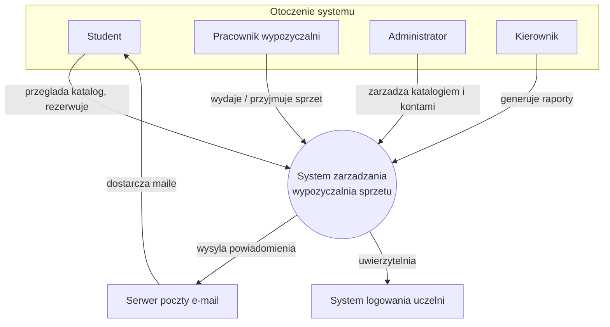
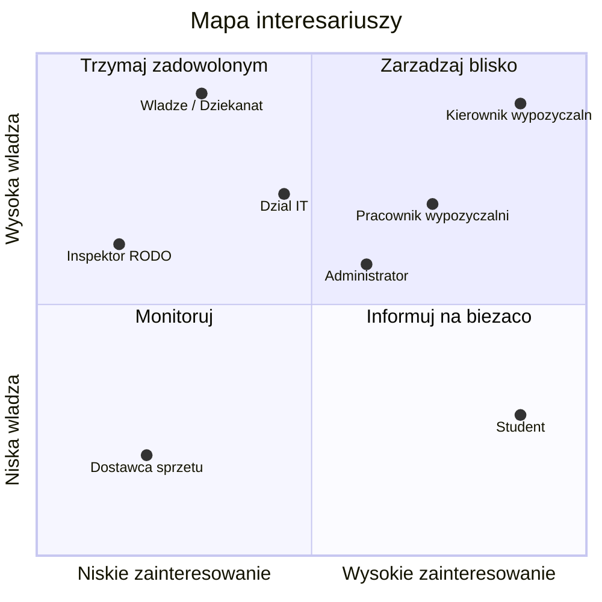

# 1. Kontekst i interesariusze

## 1.1. Opis kontekstu systemu

### Stan obecny (AS-IS)

Wypożyczalnia obsługuje sprzęt udostępniany studentom w następujących grupach:

- sprzęt IT: laptopy, rzutniki, przejściówki, klikery,
- sprzęt multimedialny: aparaty, mikrofony, statywy, oświetlenie,
- sprzęt sportowy: piłki, rakiety, narty,
- sprzęt laboratoryjny: zestawy Arduino, drukarki 3D, lutownice.

Ewidencja prowadzona jest ręcznie (zeszyt, arkusz kalkulacyjny). Zidentyfikowane problemy:

- brak informacji o aktualnej dostępności sprzętu,
- brak kontroli terminów zwrotu,
- brak rejestru uszkodzeń i odpowiedzialności,
- brak danych statystycznych o wykorzystaniu sprzętu,
- kolejki przy stanowisku obsługi.

### Stan docelowy (TO-BE)

Webowa aplikacja zapewniająca:

- katalog sprzętu z informacją o dostępności i rezerwacją online,
- rejestrację wydań i zwrotów przez pracownika,
- automatyczne powiadomienia o terminach,
- zarządzanie katalogiem i kontami,
- raporty dla kierownictwa.

### Granice systemu

| W zakresie | Poza zakresem |
|---|---|
| Katalog i rezerwacje sprzętu | Płatności i rozliczenia finansowe |
| Wypożyczenia i zwroty | Fizyczne zamki/szafki |
| Powiadomienia e-mail | Natywna aplikacja mobilna |
| Raporty i statystyki | Integracja z USOS/dziekanatem |
| Konta i role użytkowników | Serwis i naprawa sprzętu |

### Diagram kontekstowy

## 1.2. Użytkownicy systemu

| Użytkownik | Opis | Zakres działań | Poziom techniczny |
|---|---|---|---|
| Student | Wypożyczający sprzęt | Przeglądanie katalogu, rezerwacja, podgląd wypożyczeń, odbiór powiadomień | Średni |
| Pracownik wypożyczalni | Obsługa stanowiska | Wydanie i przyjęcie sprzętu, akceptacja/odrzucenie rezerwacji, zgłaszanie uszkodzeń | Średni |
| Administrator | Obsługa techniczna | Zarządzanie katalogiem, kontami i rolami, konfiguracja | Wysoki |
| Kierownik | Nadzór | Generowanie raportów i statystyk, decyzje zakupowe | Niski |

## 1.3. Mapa interesariuszy

### Lista interesariuszy

| Interesariusz | Typ | Interes |
|---|---|---|
| Student | Użytkownik końcowy | Szybkie wypożyczenie sprzętu |
| Pracownik wypożyczalni | Użytkownik końcowy | Ograniczenie pracy ręcznej |
| Administrator | Użytkownik / utrzymanie | Stabilność i łatwość zarządzania |
| Kierownik wypożyczalni | Decydent | Kontrola kosztów, raporty |
| Władze uczelni / Dziekanat | Sponsor | Wykorzystanie majątku uczelni |
| Dział IT uczelni | Utrzymanie / dostawca | Bezpieczeństwo, integracja SSO, hosting |
| Inspektor ochrony danych (IOD) | Regulator | Zgodność z RODO |
| Dostawca sprzętu | Zewnętrzny | Informacja o zapotrzebowaniu |

### Macierz władza / zainteresowanie (Mendelow)

Klasyfikacja:

- Zarządzaj blisko: Kierownik, Pracownik, Administrator.
- Trzymaj zadowolonym: Władze uczelni, Dział IT, IOD.
- Informuj na bieżąco: Student.
- Monitoruj: Dostawca sprzętu.
