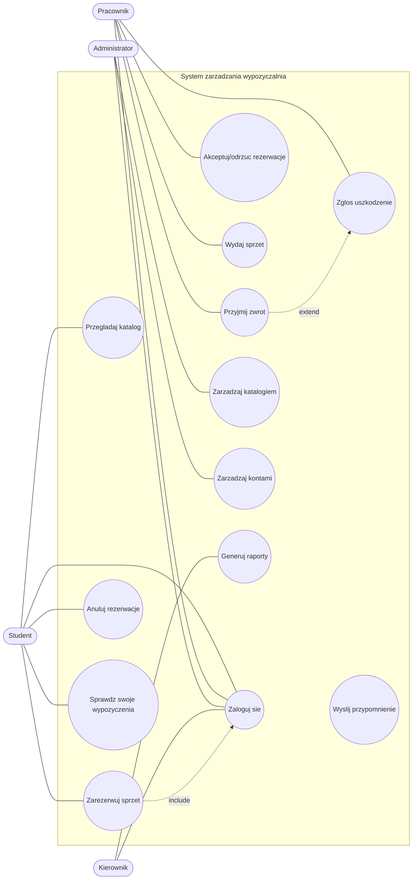
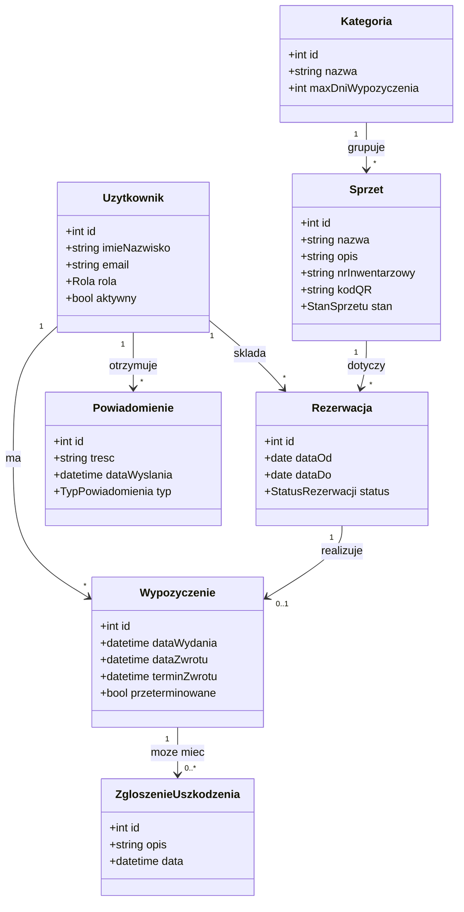
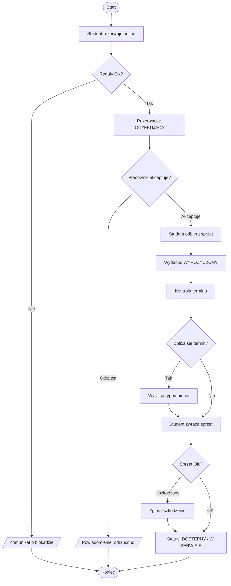
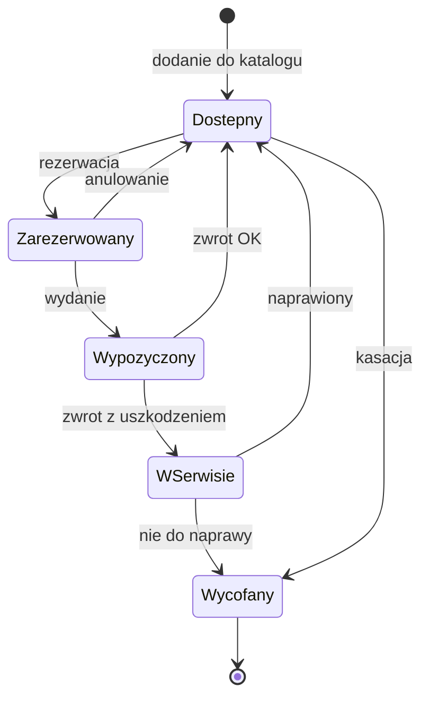

# 4. Modelowanie

Diagramy zapisano w notacji Mermaid. Pliki źródłowe oraz wersje draw.io znajdują się w katalogu `diagramy/`.

## 4.1. Diagram przypadków użycia

Relacje:

- include: rezerwacja (UC3) wymaga uwierzytelnienia (UC1).
- extend: zgłoszenie uszkodzenia (UC9) rozszerza przyjęcie zwrotu (UC8).
- UC13 wyzwalany jest przez system na podstawie czasu.

## 4.2. Diagram klas

## 4.3. Diagram aktywności – proces wypożyczenia

## 4.4. Diagram stanów egzemplarza sprzętu

