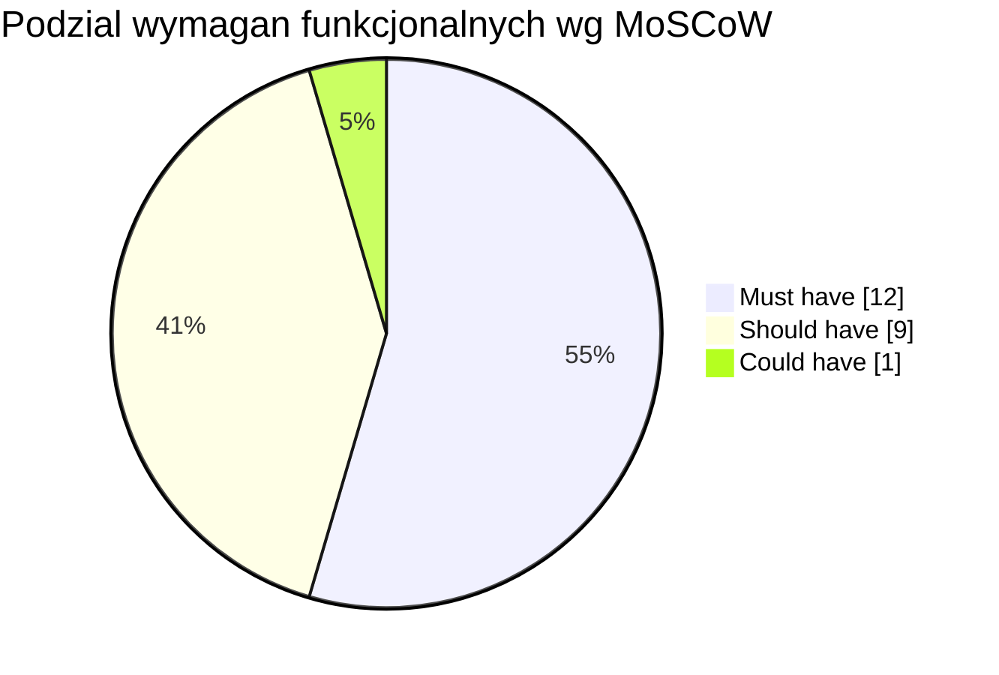
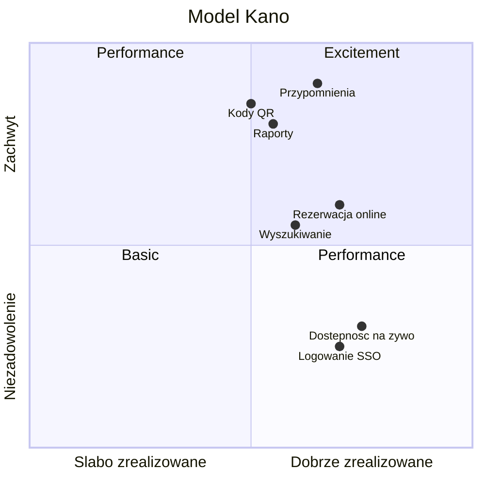

# 5. Priorytetyzacja wymagań

Zastosowano dwie metody: MoSCoW oraz model Kano.

## 5.1. Metoda MoSCoW

| Kategoria | Wymagania | Liczba |
|---|---|---|
| Must have | FR-01, FR-03, FR-04, FR-07, FR-08, FR-09, FR-11, FR-12, FR-13, FR-14, FR-20, FR-21 | 12 |
| Should have | FR-02, FR-05, FR-06, FR-10, FR-15, FR-16, FR-17, FR-18, FR-22 | 9 |
| Could have | FR-19 | 1 |
| Won't have | płatności online, oceny sprzętu | — |
| Faza 2 (poza MVP) | FR-25, FR-26 | 2 |

Zakres Must have stanowi MVP obejmujące logowanie, katalog, rezerwację, wydanie i zwrot, powiadomienia oraz administrację.

## 5.2. Model Kano

| Kategoria | Wymagania | Charakterystyka |
|---|---|---|
| Basic | FR-01, FR-03, FR-12, FR-13 | Wymagania oczekiwane; ich brak powoduje niezadowolenie |
| Performance | FR-07, FR-05, NFR-01 | Zadowolenie rośnie wraz z jakością realizacji |
| Excitement | FR-14, FR-19, FR-22 | Funkcje wyróżniające, podnoszące satysfakcję |

## 5.3. Uzasadnienie priorytetów

| Wymaganie | Priorytet | Uzasadnienie |
|---|---|---|
| FR-01 | M | Fundament dla kont, ról i zgodności z RODO |
| FR-03 | M | 38% respondentów rezygnuje z powodu braku informacji o dostępności |
| FR-07 | M | 89% respondentów oczekuje rezerwacji online |
| FR-08, FR-09 | M | Wynikają wprost z regulaminu (BR-03, BR-04) |
| FR-12, FR-13 | M | Rdzeń procesu obsługi |
| FR-14 | M | Adresuje główny problem: przetrzymywanie sprzętu |
| FR-20, FR-21 | M | Warunek wprowadzenia danych i nadawania ról |
| FR-05 | S | Istotne przy dużym katalogu, niekonieczne w MVP |
| FR-06 | S | Status dostępności (FR-03) wystarcza na etapie MVP |
| FR-16, FR-17 | S | Istotne dla rozliczalności, nie blokują obiegu podstawowego |
| FR-22 | S | Raportowanie okresowe, możliwe po MVP |
| FR-19 | C | Wymaga dodatkowego sprzętu (skanery, etykiety) |
| FR-25 | M (faza 2) | Automatyzuje regułę BR-01; wdrożenie po MVP (ZM-02) |
| FR-26 | M (faza 2) | Uzupełnia kanał e-mail o push; wdrożenie w wariancie PWA (ZM-03) |
