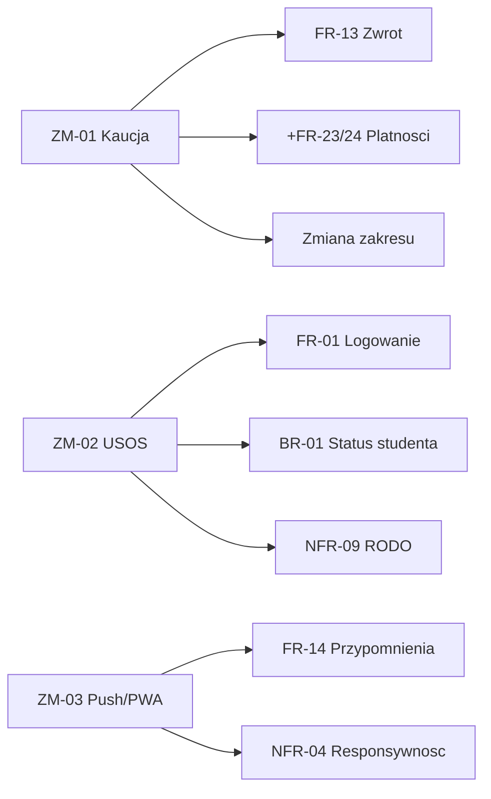

# 7. Zarządzanie zmianą

## 7.1. Proponowane zmiany

| ID | Zmiana | Typ | Opis |
|---|---|---|---|
| ZM-01 | Kaucja i opłaty za przetrzymanie | Zmiana biznesowa | Blokada kaucji przy wypożyczeniu droższego sprzętu oraz naliczanie opłaty za każdy dzień zwłoki |
| ZM-02 | Integracja z USOS | Nowy interesariusz, zmiana zakresu | Automatyczna weryfikacja aktywności studenta przez USOS API |
| ZM-03 | Aplikacja mobilna z powiadomieniami push | Zmiana zakresu funkcjonalnego | Powiadomienia push (PWA) obok lub zamiast e-mail |

## 7.2. Analiza wpływu (impact analysis)

### ZM-01 – Kaucja i opłaty

| Wymiar | Wpływ |
|---|---|
| Nowe wymagania | FR-23 (blokada kaucji), FR-24 (naliczanie opłat), NFR-14 (integracja płatności, PCI DSS) |
| Zmienione wymagania | FR-13, zmiana zakresu (płatności poza zakresem MVP) |
| Model danych | Nowe encje Kaucja, Oplata; modyfikacja Wypozyczenie |
| Interesariusze | Dział finansowy/Kwestura, operator płatności |
| Koszt i czas | Wysoki |
| Ryzyko | Wysokie (dane finansowe, RODO, odpowiedzialność prawna) |
| Decyzja | Odłożone do fazy 3 |

### ZM-02 – Integracja z USOS

| Wymiar | Wpływ |
|---|---|
| Nowe wymagania | FR-25 (pobieranie statusu z USOS), NFR-15 (obsługa awarii USOS) |
| Zmienione wymagania | FR-01, BR-01, NFR-09 |
| Model danych | Źródłem Uzytkownik.aktywny staje się USOS |
| Interesariusze | Administrator USOS / Dział IT |
| Koszt i czas | Średni |
| Ryzyko | Średnie (zależność od systemu zewnętrznego, wymagany fallback) |
| Decyzja | Przyjęte do fazy 2 |

### ZM-03 – Aplikacja mobilna z push

| Wymiar | Wpływ |
|---|---|
| Nowe wymagania | FR-26 (powiadomienia push), NFR-16 (aplikacja PWA) |
| Zmienione wymagania | FR-14 (kanał push), NFR-04 |
| Model danych | Nowa encja UrzadzeniePush; rozszerzenie Powiadomienie.typ |
| Interesariusze | Dział IT (utrzymanie) |
| Koszt i czas | Średni (PWA) / wysoki (aplikacja natywna) |
| Ryzyko | Niskie–średnie |
| Decyzja | Przyjęte w wariancie PWA |

### Mapa wpływu zmian

## 7.3. Aktualizacja dokumentacji

Nowe wymagania wprowadzone w wyniku decyzji:

| ID | Wymaganie | Zmiana | Status |
|---|---|---|---|
| FR-25 | Pobieranie statusu studenta z USOS | ZM-02 | Przyjęte (faza 2) |
| NFR-15 | Obsługa niedostępności USOS | ZM-02 | Przyjęte (faza 2) |
| FR-26 | Powiadomienia push | ZM-03 | Przyjęte (PWA) |
| NFR-16 | Aplikacja PWA | ZM-03 | Przyjęte (PWA) |
| FR-23, FR-24, NFR-14 | Kaucja i opłaty | ZM-01 | Odłożone (faza 3) |

Zmiany w pozostałych elementach:

- Granice systemu: USOS przeniesiony z „poza zakresem" do fazy 2; płatności pozostają poza zakresem.
- Mapa interesariuszy: dodano administratora USOS.

Rejestr zmian:

| Data | Zmiana | Decyzja | Zatwierdzający |
|---|---|---|---|
| 2026-05-31 | ZM-01 | Odłożone | Kierownik, Dział IT |
| 2026-05-31 | ZM-02 | Faza 2 | Dziekanat, Dział IT |
| 2026-05-31 | ZM-03 | Przyjęte (PWA) | Kierownik, Studenci |

## 7.4. Uzasadnienie decyzji

- ZM-01 odłożone: płatności wykraczają poza zakres MVP, niosą ryzyko prawne i RODO oraz wymagają nowego interesariusza (Kwestura).
- ZM-02 przyjęte do fazy 2: automatyzuje regułę BR-01; ryzyko zależności od USOS ograniczone wymaganiem NFR-15.
- ZM-03 przyjęte w wariancie PWA: realizuje zapotrzebowanie na kanał mobilny przy ograniczonym koszcie utrzymania.

## 7.5. Rozpatrywanie zmian w trybie role-playing

Posiedzenie zespołu oceny zmian (CAB). Stanowiska interesariuszy:

| Interesariusz | Stanowisko |
|---|---|
| Pracownik | Sprzeciw wobec ZM-01 (obciążenie obsługi, obsługa terminala); akceptacja ZM-03 |
| Kierownik | Poparcie ZM-01 (ograniczenie strat); poparcie ZM-03 |
| Dział IT | Sprzeciw wobec ZM-01 w MVP (PCI DSS); akceptacja ZM-02 (istniejące SSO) |
| Inspektor RODO | Warunkowa akceptacja ZM-02 (wymagana umowa powierzenia); wyższe ryzyko przy ZM-01 |
| Student | Sprzeciw wobec kaucji (ZM-01); poparcie ZM-03 |

Ustalenia CAB:

- ZM-03 (PWA + push) — przyjęte.
- ZM-02 (USOS) — przyjęte do fazy 2 pod warunkiem zawarcia umowy powierzenia danych.
- ZM-01 (kaucja) — odłożone do fazy 3; warunkiem powrotu jest pomiar rzeczywistych strat (FR-22).
