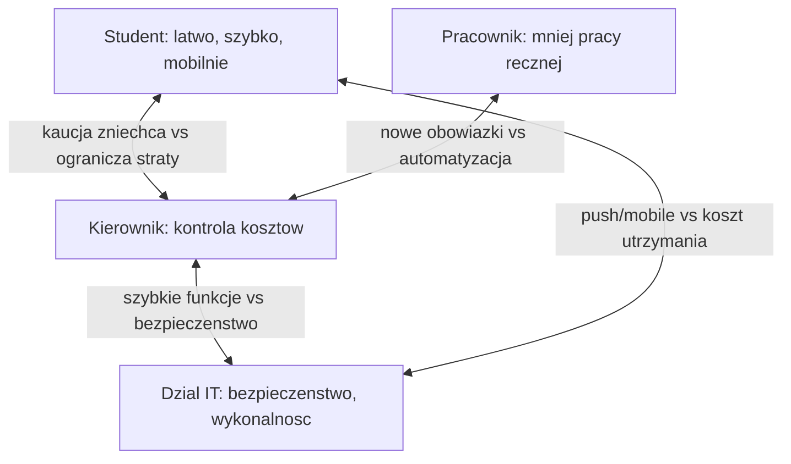

# 8. Role-playing

## 8.1. Obsada ról

| Członek zespołu | Rola | Perspektywa |
|---|---|---|
| Osoba A | Student | Szybkość, dostęp mobilny, prostota |
| Osoba B | Pracownik wypożyczalni | Ograniczenie pracy ręcznej, jednoznaczne statusy |
| Osoba C | Kierownik | Koszty, ograniczenie strat, raporty |
| Osoba D | Administrator / Dział IT | Bezpieczeństwo, integracje, wykonalność techniczna |

## 8.2. Konflikty interesów

| Temat | Student | Pracownik | Kierownik | Dział IT |
|---|---|---|---|---|
| Kaucja (ZM-01) | Przeciw | Przeciw (obciążenie) | Za (straty) | Przeciw w MVP (PCI DSS) |
| Logowanie | Konto uczelni | Neutralne | Za (rozliczalność) | SSO/LDAP |
| Przypomnienia | Push | Za (odciążenie) | Za (mniej przetrzymań) | E-mail prostszy niż push |
| Raporty | Neutralne | Neutralne | Kluczowe | Wymaga budowy i utrzymania |

## 8.3. Wykorzystanie role-playing w analizie zmian

Priorytet rezerwacji online:

- Student: rezerwacja online jako warunek podstawowy.
- Pracownik: konieczność zachowania kontroli nad akceptacją.
- Ustalenie: rezerwacja online (FR-07) wraz z akceptacją pracownika (FR-11); oba wymagania Must have.

Kaucja (ZM-01):

- Konflikt: Kierownik za, Student i Pracownik przeciw, Dział IT wskazuje ryzyko.
- Ustalenie: decyzja warunkowana pomiarem rzeczywistych strat (FR-22); zmiana odłożona do fazy 3.

Powiadomienia push (ZM-03):

- Konsensus interesariuszy; przyjęte w wariancie PWA.
