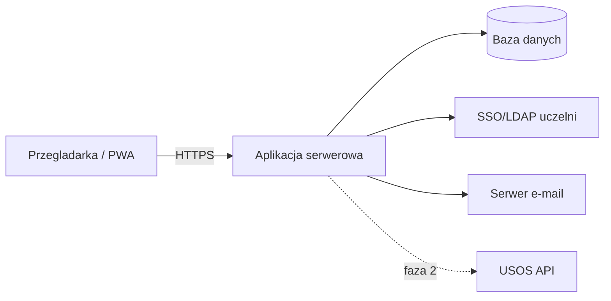

# 9. Specyfikacja wymagań oprogramowania (SRS / IEEE 830)

## 1. Wprowadzenie

### 1.1. Cel dokumentu

Dokument określa wymagania dla Systemu zarządzania wypożyczalnią sprzętu studenckiego. Odbiorcy: zespół projektowy, prowadzący, interesariusze.

### 1.2. Zakres produktu

Webowa aplikacja do zarządzania wypożyczaniem sprzętu studentom: katalog, rezerwacje, wypożyczenia, zwroty, powiadomienia, raporty. Cel: eliminacja ewidencji ręcznej, kolejek i przekraczania terminów zwrotu.

### 1.3. Definicje i skróty

| Skrót | Znaczenie |
|---|---|
| SRS | Software Requirements Specification |
| FR / NFR | Wymaganie funkcjonalne / niefunkcjonalne |
| BR | Reguła biznesowa |
| SSO / LDAP | Logowanie jednokrotne / katalog uczelni |
| MVP | Minimum Viable Product |
| RBAC | Kontrola dostępu oparta na rolach |

### 1.4. Odniesienia

- IEEE 830-1998.
- Szablon Volere.
- Regulamin wypożyczalni uczelnianej.

## 2. Opis ogólny

### 2.1. Perspektywa produktu

System samodzielny, integrujący się z SSO uczelni (logowanie) oraz serwerem poczty (powiadomienia). W fazie 2 przewidziana integracja z USOS. Architektura klient–serwer z bazą danych.

### 2.2. Funkcje produktu

- Przeglądanie katalogu i dostępności.
- Rezerwacja online.
- Rejestracja wydań i zwrotów.
- Automatyczne powiadomienia.
- Zarządzanie katalogiem i kontami.
- Raporty.

### 2.3. Charakterystyka użytkowników

Role: Student, Pracownik, Administrator, Kierownik. Zróżnicowany poziom techniczny uzasadnia wymagania użyteczności (NFR-05) i dostępności (NFR-06).

### 2.4. Ograniczenia

- C-01: Logowanie wyłącznie przez SSO uczelni.
- C-02: Zgodność z RODO.
- C-03: Działanie w przeglądarce, bez instalacji.
- C-04: Hosting po stronie Działu IT uczelni.

### 2.5. Założenia i zależności

- Dostępność SSO/LDAP uczelni.
- Dostępność danych o statusie studenta (ręcznie w MVP, z USOS w fazie 2).
- Dostępność serwera poczty dla powiadomień.

### 2.6. Reguły biznesowe

| ID | Reguła |
|---|---|
| BR-01 | Wypożyczać może wyłącznie aktywny student |
| BR-02 | Domyślny maksymalny czas wypożyczenia: 14 dni |
| BR-03 | Student z zaległym zwrotem nie może rezerwować |
| BR-04 | Maksymalnie 3 aktywne wypożyczenia na studenta |

## 3. Wymagania szczegółowe

### 3.1. Wymagania funkcjonalne

| Moduł | Wymagania |
|---|---|
| Konto i logowanie | FR-01, FR-02 |
| Katalog | FR-03, FR-04, FR-05, FR-06 |
| Rezerwacje i wypożyczenia | FR-07–FR-15 |
| Stan i historia | FR-16, FR-17, FR-18, FR-19 |
| Administracja i raporty | FR-20, FR-21, FR-22 |
| Faza 2 | FR-25, FR-26 |

Pełne brzmienie wymagań funkcjonalnych zawiera dokument 03-specyfikacja-wymagan.md.

### 3.2. Interfejsy zewnętrzne

- Interfejs użytkownika: responsywny web (NFR-04), WCAG 2.1 AA (NFR-06).
- Interfejs sprzętowy: czytnik kodów QR/kreskowych (FR-19).
- Interfejs programowy: SSO/LDAP (FR-01), SMTP (FR-14), USOS API (FR-25, faza 2).
- Interfejs komunikacyjny: HTTPS/TLS 1.2+ (NFR-08).

### 3.3. Wymagania niefunkcjonalne

| Kategoria | Wymagania |
|---|---|
| Wydajność | NFR-01, NFR-02, NFR-03 |
| Użyteczność | NFR-04, NFR-05, NFR-06 |
| Bezpieczeństwo | NFR-07, NFR-08, NFR-09, NFR-10 |
| Niezawodność i utrzymanie | NFR-11, NFR-12, NFR-13 |

## 4. Historia zmian dokumentu

| Wersja | Data | Opis |
|---|---|---|
| 1.0 | 2026-05-31 | Pierwsza pełna wersja SRS |
| 1.1 | 2026-05-31 | Wymagania z ZM-02, ZM-03 (faza 2) |
